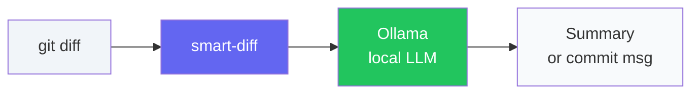
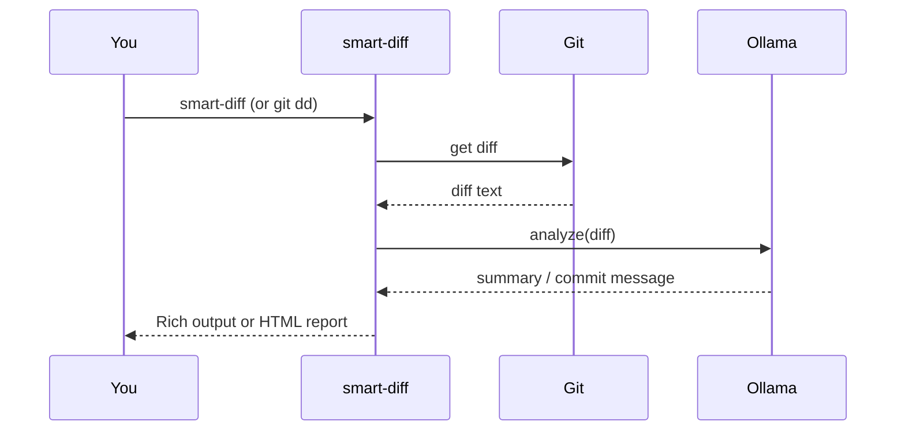
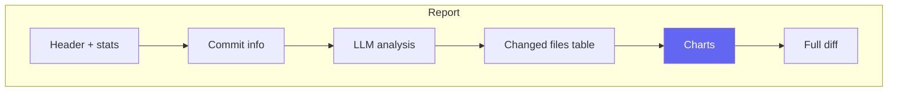

<div align="center">

# Smart Diff (Git Deep-Diff)

[](https://opensource.org/licenses/MIT)
[](https://www.python.org/downloads/)
[](https://ollama.com)

**[Русский](README.ru.md)** | English

*Turn raw `git diff` into plain-language summaries using a local LLM.  
Quick code review and concrete commit messages — no data leaves your machine.*

</div>

---

## 📑 Table of contents

- [How it works](#-how-it-works)
- [Requirements](#-requirements)
- [Installation](#-installation)
- [Quick start](#-quick-start)
- [Commands](#-commands)
- [Features](#-features)
- [Example output](#-example-output)
- [HTML report](#-html-report)
- [Development](#-development)
- [Publishing your fork](#-publishing-your-fork-on-github)
- [License](#-license)

---

## 🔄 How it works



1. You run **smart-diff** (or `git dd`) on your changes or a commit.
2. Your **git diff** is sent only to **Ollama** on your machine.
3. The LLM returns a **summary** (what changed, risks) or a **commit message**.

<details>
<summary>📌 See sequence diagram</summary>



</details>

---

## 📋 Requirements

| Requirement | Details |
|-------------|---------|
| **Python** | 3.8 or newer |
| **Ollama** | [Install Ollama](https://ollama.com) and start it |
| **Model** | e.g. `ollama pull llama3` or `ollama pull deepseek-r1` · list: `ollama list` |

---

## 📦 Installation

**From source (clone and install):**

```bash
git clone https://github.com/uragrom/smart-diff.git
cd smart-diff
pip install .
```

**Directly from GitHub:**

```bash
pip install git+https://github.com/uragrom/smart-diff.git
```

---

## 🚀 Quick start

**1. Use as `git dd` (optional):**

```bash
git config --global alias.dd '!smart-diff'
```

**2. Run it:**

```bash
git dd                      # analyze current changes (or last commit if clean)
git dd --staged             # only staged
git dd -r HEAD              # last commit
git dd -m deepseek-r1       # use a specific model
git dd --html report.html   # generate HTML report with charts
```

<details>
<summary>💡 More examples</summary>

```bash
# Generate a commit message (for hook or copy-paste)
smart-diff --commit-msg

# Russian output and analysis
smart-diff -l ru

# Set default model and language
smart-diff config set model deepseek-r1
smart-diff config show
```

</details>

---

## 📌 Commands

| Command | Description |
|--------|-------------|
| `smart-diff` | Analyze current changes (or last commit when clean) |
| `smart-diff --staged` / `-s` | Only staged changes |
| `smart-diff --ref HEAD` / `-r HEAD~1` | Analyze a given commit |
| `smart-diff --commit-msg` | Generate a **concrete** one-line commit message |
| `smart-diff -m <model>` | Override model (e.g. `deepseek-r1`) |
| `smart-diff -l en` / `--lang ru` | Output/LLM language: `en`, `ru`, `auto` |
| `smart-diff config set model <name>` | Set default model |
| `smart-diff config set lang en\|ru\|auto` | Set default language |
| `smart-diff config show` | Show current config (model, language, report options) |
| `smart-diff config set report_theme dark\|light` | Report theme |
| `smart-diff config set report_auto_open true\|false` | Open report in browser after generation |
| `smart-diff --html report.html` | Write HTML report (analysis + charts + full diff) |

---

## ✨ Features

| Feature | Description |
|--------|-------------|
| 🧹 **Junk filtering** | Skips `package-lock.json`, `node_modules/`, etc. so the LLM sees only relevant code. |
| 📏 **Large diffs** | Truncates huge diffs while keeping the tail for context. |
| ⚙️ **Config** | Default model & language via `config set` / `config show`. |
| 🌐 **Language** | `-l en` / `-l ru` / `-l auto` for CLI and LLM. |
| 📊 **HTML report** | Single self-contained file: commit info, analysis, **Chart.js charts** (bar, doughnut, by extension, net change) with **load animations**. Works as `file://` in any browser. |
| 🔗 **Clickable path** | In the terminal, the report path is a link you can click to open. |
| 🪝 **Pre-commit hook** | Auto-fill commit message from staged diff. |

<details>
<summary>🪝 Set up pre-commit hook</summary>

```bash
cp hooks/prepare-commit-msg.example .git/hooks/prepare-commit-msg
chmod +x .git/hooks/prepare-commit-msg
```

On the next `git commit`, the message will be generated from staged changes.

</details>

---

## 📺 Example output

**Terminal (Rich panel):**

```
Model: llama3. Analyzing changes...
╭────────────────── Smart Diff — change analysis ──────────────────╮
│ **Brief summary**                                                │
│ Refactored auth: JWT replaced with server sessions.              │
│                                                                  │
│ **Key changes**                                                  │
│ - Switched to server sessions in `auth.py`                       │
│ - Removed token from headers in `api.py`                         │
│                                                                  │
│ **Potential risks**                                              │
│ None found.                                                      │
╰──────────────────────────────────────────────────────────────────╯
```

**With `--html report.html`** you get a single HTML file with:

- Header and stats (files, +/− lines, net)
- Commit details (if analyzing a commit)
- LLM analysis (rendered markdown)
- Table of changed files
- **Charts:** stacked bar (per file), doughnut (added vs deleted), by extension, add/del per file, net change per file
- Full diff at the bottom  
Charts animate on load; the file works offline (no CDN).

---

## 📊 HTML report



- **One file** — no external CSS/JS; Chart.js and styles are inlined so it works from `file://`.
- **Animations** — sections fade in; charts appear one by one with a short delay.
- **Clickable path** — after generation, the path in the terminal is a link (e.g. `report.html`) that opens in the browser.

---

## 🛠 Development

```bash
pip install -e ".[dev]"
ruff check src
ruff format src
```

See [CONTRIBUTING.md](CONTRIBUTING.md) for guidelines and how to open PRs.

---


## 📄 License

MIT — see [LICENSE](LICENSE).
