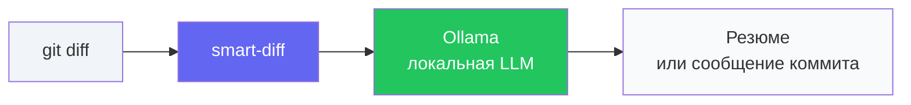
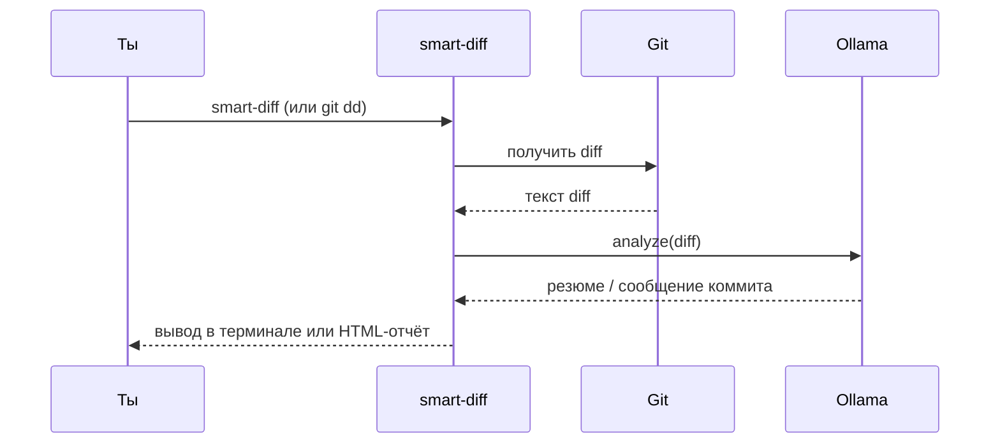
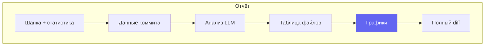

<div align="center">

# Smart Diff (Git Deep-Diff)

[](https://opensource.org/licenses/MIT)
[](https://www.python.org/downloads/)
[](https://ollama.com)

[English](README.md) | **Русский**

*Превращает сырой `git diff` в понятное резюме с помощью локальной LLM.  
Быстрый код-ревью и конкретные сообщения коммитов — данные не покидают твой компьютер.*

</div>

---

## 📑 Содержание

- [Как это устроено](#-как-это-устроено)
- [Требования](#-требования)
- [Установка](#-установка)
- [Быстрый старт](#-быстрый-старт)
- [Команды](#-команды)
- [Возможности](#-возможности)
- [Пример вывода](#-пример-вывода)
- [HTML-отчёт](#-html-отчёт)
- [Разработка](#-разработка)
- [Публикация форка](#-публикация-своего-форка-на-github)
- [Лицензия](#-лицензия)

---

## 🔄 Как это устроено



1. Ты запускаешь **smart-diff** (или `git dd`) на своих изменениях или коммите.
2. **git diff** отправляется только в **Ollama** на твоей машине.
3. LLM возвращает **резюме** (что изменилось, риски) или **сообщение коммита**.

<details>
<summary>📌 Диаграмма последовательности</summary>



</details>

---

## 📋 Требования

| Требование | Детали |
|------------|--------|
| **Python** | 3.8 или новее |
| **Ollama** | [Установить Ollama](https://ollama.com) и запустить |
| **Модель** | например `ollama pull llama3` или `ollama pull deepseek-r1` · список: `ollama list` |

---

## 📦 Установка

**Из исходников:**

```bash
git clone https://github.com/uragrom/smart-diff.git
cd smart-diff
pip install .
```

**Напрямую с GitHub:**

```bash
pip install git+https://github.com/uragrom/smart-diff.git
```

---

## 🚀 Быстрый старт

**1. Использовать как `git dd` (по желанию):**

```bash
git config --global alias.dd '!smart-diff'
```

**2. Запуск:**

```bash
git dd                      # разбор текущих изменений (или последнего коммита)
git dd --staged             # только staged
git dd -r HEAD              # последний коммит
git dd -m deepseek-r1       # указать модель
git dd --html report.html   # сгенерировать HTML-отчёт с графиками
```

<details>
<summary>💡 Ещё примеры</summary>

```bash
# Сгенерировать сообщение коммита (для хука или копирования)
smart-diff --commit-msg

# Вывод и анализ на русском
smart-diff -l ru

# Задать модель и язык по умолчанию
smart-diff config set model deepseek-r1
smart-diff config show
```

</details>

---

## 📌 Команды

| Команда | Описание |
|--------|----------|
| `smart-diff` | Анализ текущих изменений (или последнего коммита при чистой копии) |
| `smart-diff --staged` / `-s` | Только проиндексированные изменения |
| `smart-diff --ref HEAD` / `-r HEAD~1` | Разбор указанного коммита |
| `smart-diff --commit-msg` | Сгенерировать **конкретное** сообщение коммита |
| `smart-diff -m <модель>` | Задать модель (например `deepseek-r1`) |
| `smart-diff -l ru` / `--lang en` | Язык вывода и LLM: `en`, `ru`, `auto` |
| `smart-diff config set model <имя>` | Модель по умолчанию |
| `smart-diff config set lang en\|ru\|auto` | Язык по умолчанию |
| `smart-diff config show` | Показать конфиг (модель, язык, настройки отчёта) |
| `smart-diff config set report_theme dark\|light` | Тема отчёта |
| `smart-diff config set report_auto_open true\|false` | Открывать отчёт в браузере после генерации |
| `smart-diff --html report.html` | Записать HTML-отчёт (анализ + графики + полный diff) |

---

## ✨ Возможности

| Возможность | Описание |
|-------------|----------|
| 🧹 **Фильтр мусора** | Исключает `package-lock.json`, `node_modules/` и т.п. — LLM видит только нужный код. |
| 📏 **Большие диффы** | Обрезает огромные diff'ы, сохраняя хвост для контекста. |
| ⚙️ **Конфиг** | Модель и язык по умолчанию через `config set` / `config show`. |
| 🌐 **Язык** | `-l en` / `-l ru` / `-l auto` для CLI и ответов LLM. |
| 📊 **HTML-отчёт** | Один самодостаточный файл: данные коммита, анализ, **графики Chart.js** (столбцы, круг, по расширениям, итог по файлам) с **анимацией при загрузке**. Работает по `file://` в любом браузере. |
| 🔗 **Кликабельный путь** | В терминале путь к отчёту — ссылка, по клику открывается в браузере. |
| 🪝 **Pre-commit hook** | Подстановка сообщения коммита из staged. |

<details>
<summary>🪝 Настроить pre-commit hook</summary>

```bash
cp hooks/prepare-commit-msg.example .git/hooks/prepare-commit-msg
chmod +x .git/hooks/prepare-commit-msg
```

При следующем `git commit` сообщение будет сгенерировано по staged-изменениям.

</details>

---

## 📺 Пример вывода

**Терминал (Rich-панель):**

```
Модель: llama3. Анализ изменений...
╭────────────────── Smart Diff — разбор изменений ──────────────────╮
│ **Краткое резюме**                                                │
│ Рефакторинг аутентификации: переход с JWT на сессии.              │
│                                                                   │
│ **Ключевые изменения**                                            │
│ - Замена JWT на серверные сессии в `auth.py`                      │
│ - Удаление передачи токена в заголовках в `api.py`                │
│                                                                   │
│ **Потенциальные риски**                                           │
│ Не обнаружено.                                                    │
╰───────────────────────────────────────────────────────────────────╯
```

**С `--html report.html`** получаешь один HTML-файл с:

- шапкой и статистикой (файлы, +/− строки, итог);
- данными коммита (если разбираешь коммит);
- анализом LLM (markdown);
- таблицей изменённых файлов;
- **графиками:** столбцы по файлам, круг (добавлено/удалено), по расширениям, по файлам, итог по файлам;
- полным diff внизу.

Графики анимируются при загрузке; файл работает офлайн (без CDN).

---

## 📊 HTML-отчёт



- **Один файл** — без внешних CSS/JS; Chart.js и стили встроены, работает по `file://`.
- **Анимации** — секции плавно появляются; графики по очереди с небольшой задержкой.
- **Кликабельный путь** — после генерации путь в терминале является ссылкой (например `report.html`), по клику открывается в браузере.

---

## 🛠 Разработка

```bash
pip install -e ".[dev]"
ruff check src
ruff format src
```

Подробнее: [CONTRIBUTING.md](CONTRIBUTING.md).

---


## 📄 Лицензия

MIT — см. [LICENSE](LICENSE).
